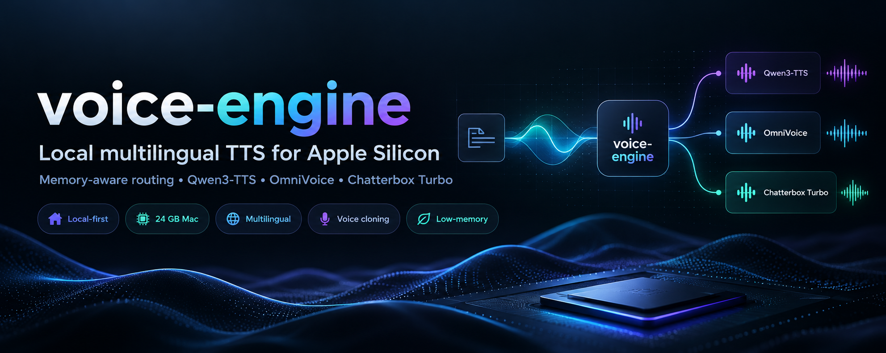

# Local Voice Engine for Apple Silicon



A small, memory-aware TTS layer for local development on a 24 GB Mac.

**License:** [PolyForm Noncommercial 1.0.0](LICENSE) — free for personal, research, and
non-commercial use. Not licensed for commercial use. See [Licensing](#licensing) below
for why, including the underlying model licenses.

## Routing

- **Qwen3-TTS 0.6B 8-bit**: default for its supported languages; fast and stream-capable.
- **OmniVoice 8-bit**: fallback for broad multilingual coverage. Set `VOICE_OMNI_MODEL=mlx-community/OmniVoice-4bit` for the smallest checkpoint.
- **Chatterbox Turbo**: optional English expressive engine. Installed only with `--all` because PyTorch/MPS adds substantial dependency and memory overhead.

Only one provider is kept active at a time by default.

## Setup

```bash
chmod +x voice_engine/setup.sh
./voice_engine/setup.sh
source .venv/bin/activate
```

Install Chatterbox too:

```bash
./voice_engine/setup.sh --all
source .venv/bin/activate
```

## Examples

Automatic routing:

```bash
voice-engine \
  --text "Today we are going to understand attention." \
  --language en \
  --task tutor
```

Nepali -> OmniVoice:

```bash
voice-engine \
  --text "आज हामी कृत्रिम बुद्धिमत्ताको आधारभूत कुरा सिक्नेछौँ।" \
  --language ne \
  --task tutor
```

Force Qwen:

```bash
voice-engine \
  --provider qwen \
  --language en \
  --voice Ryan \
  --text "Let's work through this carefully."
```

English expressive Chatterbox:

```bash
voice-engine \
  --provider chatterbox \
  --language en \
  --text "That is the key idea. [chuckle] Now let's see why it works."
```

Voice cloning:

```bash
voice-engine \
  --provider qwen \
  --language en \
  --ref-audio refs/teacher.wav \
  --ref-text "Exact transcript of the reference clip." \
  --text "This will use the cloned teacher voice."
```

For OmniVoice cloning, also provide a matching `--ref-text`; this package intentionally avoids auto-loading a separate ASR model to keep memory low.

Compare all installed providers:

```bash
python -m voice_engine.compare_en
```

## Useful environment overrides

```bash
# Smaller OmniVoice:
export VOICE_OMNI_MODEL=mlx-community/OmniVoice-4bit

# Default, safer quality/size tradeoff:
export VOICE_OMNI_MODEL=mlx-community/OmniVoice-8bit

# Qwen default and clone checkpoints:
export VOICE_QWEN_MODEL=mlx-community/Qwen3-TTS-12Hz-0.6B-CustomVoice-8bit
export VOICE_QWEN_CLONE_MODEL=mlx-community/Qwen3-TTS-12Hz-0.6B-Base-8bit

# Output location:
export VOICE_OUTPUT_DIR=./voice_outputs
```

## Notes

- Designed for **local development**, not as a production serving stack.
- Generate narration scene-by-scene rather than as one 10-minute request.
- The engine unloads the prior provider when switching providers.
- Model APIs are evolving quickly; the providers isolate library-specific calls so upgrades stay localized.
- Review each model/checkpoint's upstream license before commercial deployment.

## Licensing

This repo's code is [PolyForm Noncommercial 1.0.0](LICENSE): free to use, modify, and
share for non-commercial purposes (personal, research, education, hobby projects).
Commercial use requires a separate arrangement with the author.

This restriction exists because one of the three bundled providers ships a
non-commercial-only model checkpoint. Upstream licenses, as published by each
model's authors:

| Provider | Model | MLX implementation | License | Commercial use |
|---|---|---|---|---|
| Qwen3-TTS | `Qwen/Qwen3-TTS-*` | [mlx-audio: qwen3_tts](https://github.com/Blaizzy/mlx-audio/tree/main/mlx_audio/tts/models/qwen3_tts) | Apache 2.0 | Allowed |
| Chatterbox Turbo | [resemble-ai/chatterbox](https://github.com/resemble-ai/chatterbox/) | — (runs via PyTorch/MPS, not MLX) | MIT | Allowed |
| OmniVoice | [mlx-community/OmniVoice collection](https://huggingface.co/collections/mlx-community/omnivoice) | [mlx-audio](https://github.com/Blaizzy/mlx-audio/tree/main) | Code: Apache 2.0. **Pretrained weights: CC-BY-NC** (inherited from training data, e.g. Emilia) | **Not allowed** |

Because OmniVoice's weights are non-commercial-only, and this repo downloads and runs
those weights by default, the whole project is licensed non-commercial to match. If you
only use the Qwen3-TTS or Chatterbox providers and never load OmniVoice, those two
checkpoints' own licenses (Apache 2.0, MIT) do permit commercial use — but you are
still bound by this repo's own PolyForm Noncommercial license for the code itself.
Always verify current upstream license terms directly on each model's page before
any commercial deployment; they can change independently of this repo.

## Credits

This engine is a thin routing/memory-management layer. The actual model inference
comes from these upstream projects:

- [Blaizzy/mlx-audio](https://github.com/Blaizzy/mlx-audio/tree/main) — MLX inference
  engine for text-to-speech, speech-to-text, and other audio tasks on Apple Silicon.
  Runs Qwen3-TTS and OmniVoice here.
  - [mlx_audio/tts/models/qwen3_tts](https://github.com/Blaizzy/mlx-audio/tree/main/mlx_audio/tts/models/qwen3_tts) — Qwen3-TTS implementation.
- [mlx-community/OmniVoice checkpoints](https://huggingface.co/collections/mlx-community/omnivoice) — quantized OmniVoice weights for mlx-audio.
- [resemble-ai/chatterbox](https://github.com/resemble-ai/chatterbox/) — Chatterbox Turbo, run here via PyTorch/MPS.
